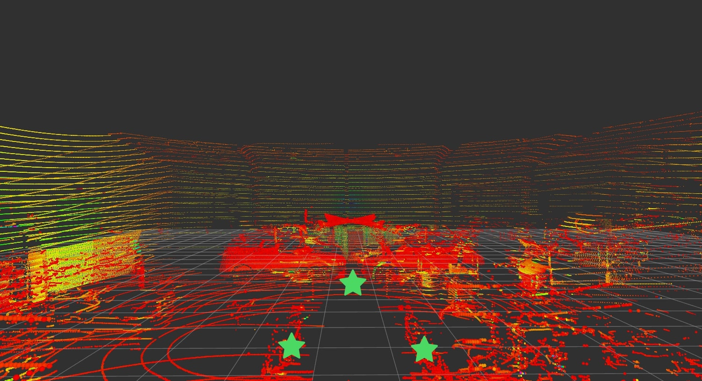
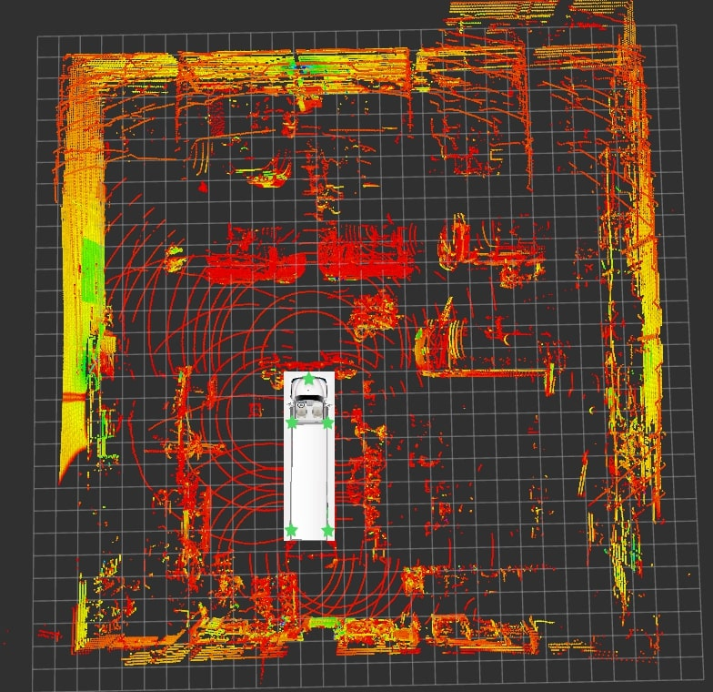
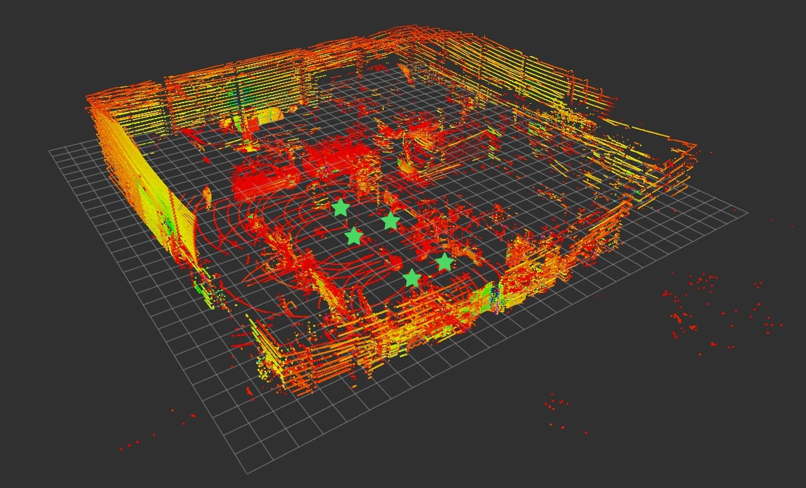

# MultiLiDAR_Transform_Fusion

_(documentation writing in progress)_

<!-- add result images -->

## MultiLiDAR Points combined results

<table style="max-width: 30%;">
    <tr>
        <th>Camera view</th>
        <th>Top view</th>
    </tr>
    <tr>
        <td style="width: 50%;"></td>
        <td style="width: 50%;"></td>
    </tr>
</table>

## 📖 How to use
#### Step 1: Inititalize and Build ROS Environment
```bash
git clone https://github.com/shoxa-mir/MultiLiDAR_Transform_Fusion.git MultiLiDAR_Transform_Fusion/
```

#### Step 2: Modify `(path_to_root)/MultiLiDAR_Transform_Fusion/src/lidar_merger/config/lidar_merger.yaml` File With Desired Translation and Rotations
```yaml
{
  'lidar1': {
    'topic': '/lidar1/pointCloud',
    'frame_id': 'lidar1',
    'static_transform': {
        'translation': [0.0, 0.0, 0.0],
        'rotation': [0.0, 0.0, 0.0, 0.0]
    }
  },
  'lidar2': {
    'topic': '/lidar2/pointCloud',
    'frame_id': 'lidar2',
    'static_transform': {
        'translation': [1.2, 2.5, -0.4],
        'rotation': [0.0, 0.0, 0.7071, 0.7071]
    }
  },
}
```

#### Step 3 Inititalize and Build ROS Environment
```bash
cd (path_to_root)/MultiLiDAR_Transform_Fusion/
catkin_make
source devel/setup.bash
```

#### Step 4: Run `lidar_merger` Node
To run from `incode configs` run:
```bash
rosrun lidar_merger lidar_merge.py
```

To run using `config file`:
```bash
rosrun lidar_merger lidar_merge_from_cfg.py
```

#### Step 4: Run `rviz` or Any Other Tool to Visualize Results

#### 3D view of full scene
<div style="max-width: 30%; margin: 0 auto;">
    
</div>
